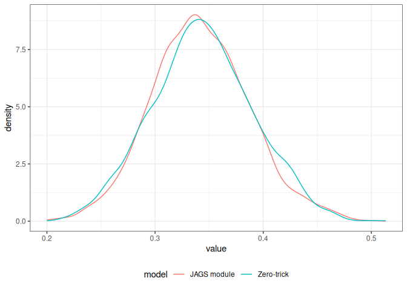
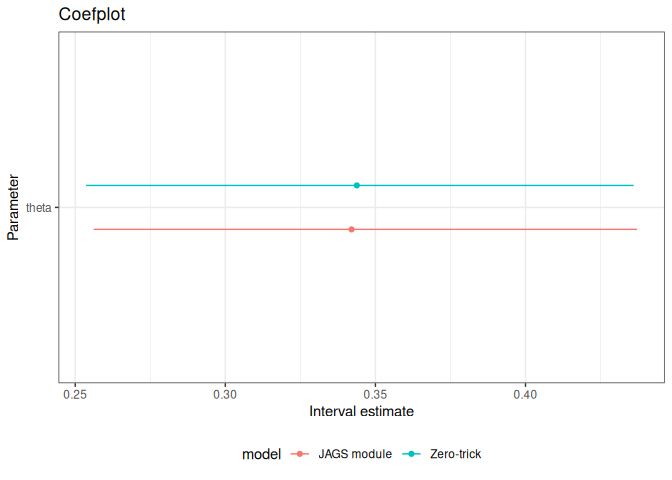

`pcprob`: a JAGS module for the PC prior on a Binomial probability
================

This work implements the **Penalised Complexity (PC) prior** for the
probability parameter $\theta$ of a Binomial model, as a custom
distribution module for [JAGS](https://mcmc-jags.sourceforge.io/). The
prior is described in [Example
2.6](https://gianluca.statistica.it/books/online/bmhta/bayesian-computation#sec-pc-prior)
of *Bayesian Models in Health Technology Assessment* (BMHTA; Baio, 2026)
and is grounded in the general PC prior framework of Simpson et
al. (2017).

------------------------------------------------------------------------

## Files

| File | Purpose |
|----|----|
| `PCProb.h` | C++ class declaration (interface to JAGS) |
| `PCProb.cpp` | Distribution implementation: density, sampler, typical value |
| `PCProbModule.cpp` | Module registration (makes the distribution available to JAGS) |
| `pcprob.la` | libtool metadata required for JAGS to locate the compiled library |
| `compile-module` | Shell script to compile the C++ files into `pcprob.so` |

------------------------------------------------------------------------

## The PC prior for a Binomial probability

### Setup

Let $y \mid \theta \sim \text{Binomial}(n, \theta)$. The PC prior places
a principled prior on $\theta \in (0,1)$ by measuring how far the
flexible model $f = \text{Bernoulli}(\theta)$ is from a **base model**
$g = \text{Bernoulli}(\theta_0)$, where $\theta_0 \in (0,1)$ is a fixed
baseline probability chosen to represent “no effect” or a clinically
meaningful reference value.

### Distance

The complexity of departing from the base model is measured by the
**scaled KL distance**

$$d(\theta) = \sqrt{2\,\text{KL}(f \,\|\, g)} = \sqrt{2\theta\log\frac{\theta}{\theta_0} + 2(1-\theta)\log\frac{1-\theta}{1-\theta_0}}$$

which satisfies $d(\theta) \geq 0$ everywhere and $d(\theta_0) = 0$ (the
base model has zero distance from itself).

### Prior

An Exponential($\lambda$) prior is placed on $d$, penalising departures
from the base model at a constant rate. Transforming back to $\theta$
via the change-of-variables formula gives the **PC prior density**
(equation 2.10 in BMHTA):

$$p(\theta) = \lambda e^{-\lambda d(\theta)} \frac{|\text{logit}(\theta) - \text{logit}(\theta_0)|}{d(\theta)}$$

The Jacobian factor
$|\text{logit}(\theta)-\text{logit}(\theta_0)|/d(\theta)$ arises from
$\partial d/\partial\theta$ and equals 1 at $\theta = \theta_0$ (by
L’Hôpital’s rule), so the density is continuous at the mode with value
$\lambda$.

The parameter $\lambda > 0$ controls how strongly complexity is
penalised: large $\lambda$ concentrates mass near $\theta_0$; small
$\lambda$ allows larger departures.

------------------------------------------------------------------------

## Implementation

### `PCProb.h` — class declaration

The class inherits from JAGS’s `ScalarDist` base class (not
`RScalarDist`, which is reserved for distributions built on top of R’s
`d/p/q/r` functions). The `ScalarDist` interface requires implementing:

- `logDensity()` — the log-density, evaluated by JAGS at every MCMC step
- `randomSample()` — one draw from the prior, used only to generate
  **initial values**
- `typicalValue()` — a representative high-density point (the mode
  $\theta_0$)
- `checkParameterValue()` — validates $\lambda > 0$ and
  $0 < \theta_0 < 1$

The constructor registers the distribution under the name `dpcprob` with
support type `DIST_PROPORTION`, that is the open interval (0,1).

### `PCProb.cpp` — distribution implementation

**Log-density (`logDensity`)**

Implements the formula above directly. At $\theta \approx \theta_0$
where $d \approx 0$, the ratio $|\text{logit-diff}|/d$ is evaluated via
its limit (1) rather than numerically, to avoid $0/0$.

JAGS uses `logDensity` inside Metropolis-Hastings or slice-sampling
steps as a log-density *ratio*, so any multiplicative normalising
constant in the prior cancels exactly. This means the sampler is correct
regardless of whether the density integrates to 1.

**Sampler (`randomSample`) — rejection sampling on the logit scale**

`randomSample` is called by JAGS only **once per chain** to generate
starting values; it is not on the MCMC hot path.

*Why not a closed-form sampler?* The density $p(\theta)$ is not
analytically invertible. On the logit scale
$\phi = \text{logit}(\theta)$ it behaves near $\theta_0$ like a Laplace
distribution, but its tails are shaped by the KL distance in a way that
precludes a simple closed-form.

*Why the logit scale?* An earlier version used a Beta envelope directly
on $\theta$. This is theoretically invalid: the ratio
$p_\text{PC}(\theta)/p_\text{Beta}(\theta)$ grows without bound as
$\theta \to 0$ or $\theta \to 1$, because the PC prior’s tails decay
like $|\log\theta|/\theta^{\theta_0}$ while the Beta drops like
$\theta^{\theta_0}$. Working on the logit scale fixes this: the Jacobian
factor $\theta(1-\theta) \sim e^{-|\phi|}$ in the tails ensures the
target decays faster than any Laplace density, so a Laplace envelope is
valid everywhere.

*Envelope.* The proposal is $\text{Laplace}(\phi_0,\, b)$ with

$$\phi_0 = \text{logit}(\theta_0), \qquad b = \frac{2}{\lambda\sqrt{\theta_0(1-\theta_0)}}$$

The scale $b$ uses the first-order approximation
$d(\theta) \approx |\phi - \phi_0|\cdot\sqrt{\theta_0(1-\theta_0)}$ near
the mode, which implies the logit-scale density looks like
$\text{Laplace}(\phi_0,\,1/(\lambda\sqrt{\theta_0(1-\theta_0)}))$ there.
The factor of 2 ensures the envelope is wider than the target throughout
(verified numerically).

*Bound (M).* The log-envelope constant
$\log M = \sup_\phi [\log p(\phi) - \log q_\text{Laplace}(\phi)]$ is
computed on a grid of 500 points spanning $\phi_0 \pm 20b$. The Laplace
tails guarantee the ratio decays to $-\infty$ outside this range, so the
grid captures the true supremum.

*Laplace sampling.* Drawing $\phi^\star \sim \text{Laplace}(\phi_0, b)$
uses the exact inverse-CDF:

$$\phi^\star = \phi_0 - b\,\text{sign}(u - 0.5)\,\log(1 - 2|u - 0.5|), \qquad u \sim \text{Uniform}(0,1)$$

requiring only `rng->uniform()` and no auxiliary Gamma variates.

*Acceptance step.* Accept $\theta^\star = \text{logistic}(\phi^\star)$
if $\log U < \log p(\phi^\star) - \log M - \log q(\phi^\star)$, where
$U \sim \text{Uniform}(0,1)$. Accepted draws are exact draws from the PC
prior (no approximation). Acceptance rates range from roughly 20% to 50%
across the parameter space.

**Typical value (`typicalValue`)**

Returns $\theta_0$, the mode of the PC prior by construction.

### `PCProbModule.cpp` — module registration

Registers the `PCProb` distribution with JAGS under the module name
`pcprob`. The global variable `pcprob_module` is the mechanism by which
JAGS’s dynamic loader finds and activates the module at load time.

------------------------------------------------------------------------

## Compilation

``` bash
g++ -std=c++11 -fPIC -shared -o pcprob.so \
    PCProb.cpp PCProbModule.cpp \
    -I/usr/include/JAGS \
    -L/usr/lib/x86_64-linux-gnu/ -ljags
```

Adjust the `-I` and `-L` paths to match your JAGS installation
(`jags-config --cflags` and `jags-config --ldflags` will give the
correct values).

This command generates the file `pcprob.so`, which is the new module
that JAGS can use.

------------------------------------------------------------------------

## Installation and use

The important files are `pcprob.so` and `pcprob.la`, which should live
in the same directory.

Then in `R` (from the working directory where the files are stored):

``` r
library(R2jags)
load.module("pcprob")
# Can specify the full path to where the so file is saved as
# load.module("pcprob",path="...")

model = function() {
  theta ~ dpcprob(lambda, theta0)
  y ~ dbin(theta, n)
}

jags(
  data = list(y = 15, n = 100, lambda = 2, theta0 = 0.2),
  parameters.to.save = "theta",
  model.file = model
)
```

This example uses a PC prior with ($\lambda=2$ and $\theta_0=0.2$) and
assumes that 15 “successes” are observed over 100 trials of a Binomial
experiment.

------------------------------------------------------------------------

## Alternative: the zero-trick

If installing the compiled module is impractical, the same prior can be
approximated in standard JAGS via the **zero-trick**.

The idea is to construct a pseudo-observation $w = 0$ from a
$\text{Poisson}(\phi)$ distribution, where $\phi = -\log p(\theta) + C$
for a large constant $C$ that keeps $\phi > 0$. The Poisson
log-likelihood $-\phi$ then contributes $\log p(\theta) - C$ to the
log-posterior, effectively imposing $p(\theta)$ as the prior.

``` r
model_zero_trick = function() {
  # Pseudo-observation
  w ~ dpois(phi)

  # PC prior components
  d_safe <- sqrt(
    2*theta*log(theta/theta0) + 2*(1-theta)*log((1-theta)/(1-theta0))
  ) + 1e-10                              # guard against d=0 at theta=theta0
  deriv <- abs(
    (log(theta) - log(1-theta) - log(theta0) + log(1-theta0)) / d_safe
  )
  phi <- -log(lambda * exp(-lambda*d_safe) * deriv) + C

  # Uniform prior on theta -- must be flat so it contributes nothing
  theta ~ dbeta(1, 1)

  # Likelihood (set y=NA to sample from the prior only)
  y ~ dbin(theta, n)
}

jags(
  data = list(w = 0, C = 10000, lambda = 2, theta0 = 0.2,
              y = 15, n = 100),
  parameters.to.save = "theta",
  model.file = model_zero_trick
)
```

Two implementation details matter here:

1.  **Use `theta ~ dbeta(1, 1)`, not `dbeta(0.5, 0.5)`.** The zero-trick
    already fully specifies the prior for $\theta$ via $\phi$. Adding
    $\text{Beta}(0.5, 0.5)$ (Jeffreys’ prior) introduces a second prior
    that compounds with the PC prior, concentrating mass near 0 and 1
    and distorting the posterior.

2.  **Guard against $d = 0$.** When the sampler visits
    $\theta = \theta_0$ exactly, $d = 0$ and `deriv` becomes
    $0/0 = \texttt{NaN}$, which causes JAGS to reject the state and
    creates an artificial hole in the posterior near the mode. Adding
    `1e-10` to `d_safe` before dividing replaces NaN with the correct
    limiting value.

### When to use the module vs the zero-trick

**Prior only.** The PC prior has a cusp (not a smooth peak) at
$\theta_0$. JAGS assigns a generic slice sampler to `dpcprob`, and slice
sampling takes small steps near the cusp, generally producing
autocorrelation. The zero-trick instead exposes a `theta ~ dbeta(1,1)`
node that JAGS can sample more efficiently, with the Poisson penalty
acting as a smooth modifier. No conjugacy is sacrificed (the PC prior
has no conjugate likelihood), so the zero-trick pays no penalty and wins
on both speed and mixing.

**With data.** The Binomial likelihood
$\text{Binonial}(y \mid \theta, n)$ is smooth and log-concave, and it
dominates the shape of the posterior when $n$ is moderately large. This
irons out the cusp of the PC prior, giving the slice sampler a smooth
target on which it mixes well. The zero-trick, on the other hand, now
has *three* contributions to $\theta$’s full conditional (the Beta base,
the Poisson penalty, and the Binomial likelihood), making the sampler’s
step-size tuning less efficient, and autocorrelation may increase
relative to the module.

The results from the two models are highly comparable.

``` r
# Loads packages and JAGS module
library(tidyverse)
library(R2jags)
load.module("pcprob",path=".")
# Can specify the full path to where the so file is saved as
# load.module("pcprob",path="...")

# JAGS model to directlyl consider the `dpcprob` prior
model = function() {
  theta ~ dpcprob(lambda, theta0)
  y ~ dbin(theta, n)
}
m1=jags(
  data = list(y = 35, n = 100, lambda = 2, theta0 = 0.2),
  parameters.to.save = "theta",
  model.file = model
)

# JAGS model using the "Zero-trick"
model_zero_trick = function() {
  # Pseudo-observation
  w ~ dpois(phi)
  # PC prior components
  d_safe <- sqrt(
    2*theta*log(theta/theta0) + 2*(1-theta)*log((1-theta)/(1-theta0))
  ) + 1e-10                              # guard against d=0 at theta=theta0
  deriv <- abs(
    (log(theta) - log(1-theta) - log(theta0) + log(1-theta0)) / d_safe
  )
  phi <- -log(lambda * exp(-lambda*d_safe) * deriv) + C
  # Uniform prior on theta -- must be flat so it contributes nothing
  theta ~ dbeta(1, 1)
  # Likelihood (set y=NA to sample from the prior only)
  y ~ dbin(theta, n)
}
m2=jags(
  data = list(w = 0, C = 10000, lambda = 2, theta0 = 0.2, y = 35, n = 100),
  parameters.to.save = "theta",
  model.file = model_zero_trick
)

# Prints the results
print(m1)
print(m2)

# And shows the resulting densities
bmhe::posteriorplot(m1)$data |> mutate(model="JAGS module") |> 
  bind_rows(bmhe::posteriorplot(m2)$data |> mutate(model="Zero-trick")) |> 
  ggplot2::ggplot(aes(x=value,col=model)) + geom_density(key_glyph="path") + 
  theme_bw() + theme(legend.position="bottom")

# As well as estimates for the mean and 95% interval of the posteriors
bmhe::coefplot(m1)$data |> mutate(model="JAGS module") |> 
  bind_rows(bmhe::coefplot(m2)$data |> mutate(model="Zero-trick")) |> 
  bmhe::coefplot(xintercept=NULL) + aes(color=model) + xlim(0,.3) + 
  theme(legend.position="bottom")
```

    ## Inference for Bugs model at "/tmp/RtmpNqrDlx/model1d6071bd28bc1.txt", 
    ##  3 chains, each with 2000 iterations (first 1000 discarded)
    ##  n.sims = 3000 iterations saved. Running time = 0.008 secs
    ##          mu.vect sd.vect  2.5%   25%   50%   75% 97.5%  Rhat n.eff
    ## theta      0.342   0.045 0.256 0.311 0.340 0.371 0.437 1.003   990
    ## deviance   5.919   1.371 4.969 5.063 5.406 6.175 9.920 1.001  3000
    ## 
    ## For each parameter, n.eff is a crude measure of effective sample size,
    ## and Rhat is the potential scale reduction factor (at convergence, Rhat=1).
    ## 
    ## DIC info (using the rule: pV = var(deviance)/2)
    ## pV = 0.9 and DIC = 6.9
    ## DIC is an estimate of expected predictive error (lower deviance is better).

    ## Inference for Bugs model at "/tmp/RtmpNqrDlx/model1d60733ff48d1.txt", 
    ##  3 chains, each with 2000 iterations (first 1000 discarded)
    ##  n.sims = 3000 iterations saved. Running time = 0.012 secs
    ##            mu.vect sd.vect      2.5%       25%       50%       75%     97.5%
    ## theta        0.344   0.047     0.254     0.313     0.343     0.375     0.436
    ## deviance 20004.338   1.344 20003.347 20003.436 20003.780 20004.709 20008.159
    ##           Rhat n.eff
    ## theta    1.002  1500
    ## deviance 1.000     1
    ## 
    ## For each parameter, n.eff is a crude measure of effective sample size,
    ## and Rhat is the potential scale reduction factor (at convergence, Rhat=1).
    ## 
    ## DIC info (using the rule: pV = var(deviance)/2)
    ## pV = 0.9 and DIC = 20005.2
    ## DIC is an estimate of expected predictive error (lower deviance is better).

<!-- --><!-- -->

The posterior estimates for $\theta$ are aligned; obviously, the model
Deviance is on a very different scale (because of the two different
model specifications).

------------------------------------------------------------------------

## References

Baio, G. (2026). *Bayesian Models in Health Technology Assessment*.
Online book. <https://gianluca.statistica.it/books/online/bmhta>

Simpson, D., Rue, H., Riebler, A., Martins, T. G., and Sørbye, S. H.
(2017). Penalising model component complexity: A principled, practical
approach to constructing priors. *Statistical Science*, 32(1), 1–28.
<https://doi.org/10.1214/16-STS576>

Wabersich, D. and Vandekerckhove, J. (2014). Extending JAGS: A tutorial
on adding custom distributions to JAGS (with a diffusion model example).
*Behavior Research Methods*, 46, 15–28.
<https://doi.org/10.3758/s13428-013-0369-3>
